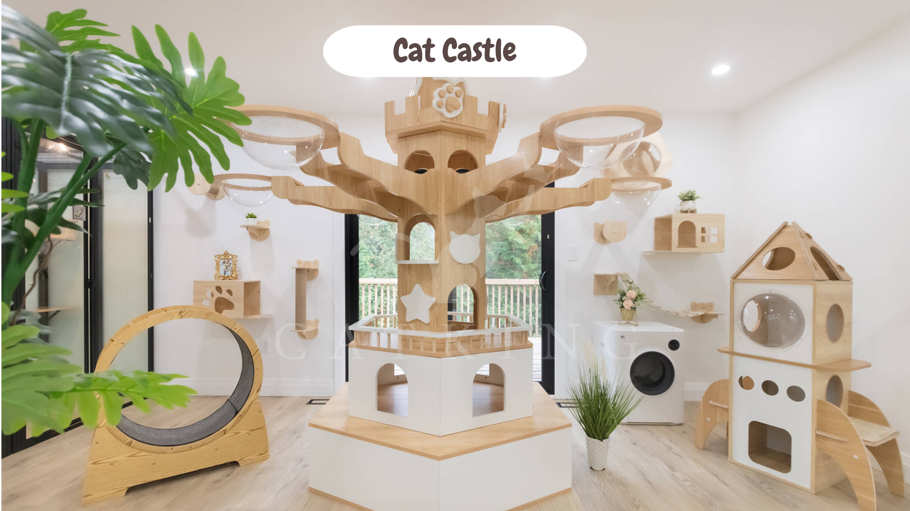

# HAKIEMI'S E-BOOKING CAT HOTEL

A web-based application for managing a cat hotel. It provides a platform for cat owners to book accommodations for their pets and for administrators to manage bookings, users, and feedback.

# 1) Key Features

*   **Dual User Roles:** The system supports two main roles with distinct permissions:
    *   **Admin:** Has full control over the system, including managing users, vehicle categories (room types), and individual vehicle entries (rooms). They can also approve or cancel bookings and manage user feedback.
    *   **User/Customer:** Can register, log in, manage their profile, book rooms for their cats, view their booking history, and provide feedback.
*   **Booking Management:** A complete booking lifecycle is supported, from checking availability to booking, and admin approval.
*   **Profile Management:** Users can update their personal and cat's profile information.
*   **Feedback System:** Customers can submit feedback, which administrators can then review, approve, and publish on the site.
*   **Admin Dashboard:** A comprehensive dashboard for administrators to get an overview of the system and manage all its components.

# 2) Technology Stack

*   **Backend:** PHP
*   **Frontend:** HTML, CSS, JavaScript, jQuery, Bootstrap
*   **Database:** MySQL / MariaDB (SQL dump provided in the `DATABASE FILE` directory)

# 3) Project Structure

The application is organized into role-based modules and shared components:

*   `/admin`: Contains the administrator's dashboard, management pages, and backend logic.
*   `/usr`: The customer-facing portal for registration, login, booking, and profile management.
*   `/vendor`: Contains shared frontend libraries and assets like Bootstrap, jQuery, and FontAwesome.
*   `/DATABASE FILE`: Contains the `hotel_booking.sql` file to set up the database schema and initial data.
*   **Root Files:** Includes the main landing page (`index.php`), informational pages (`about.php`, `services.php`), and the main entry point for user login.

# 4) Project Preview

**Homepage**

**About Us Page**

**Services/Gallery**
